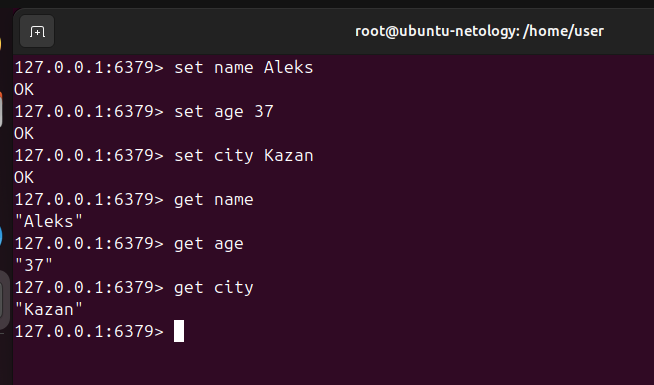

# Домашнее задание к занятию «Кеширование Redis/memcached» - Бетко Алексей

### Задание 1. Кеширование 

Приведите примеры проблем, которые может решить кеширование. 

#### Ответ
1. Повышение производительности за счет хранения данных в кэше, к которым чаще всего обращаются. 
2. Увеличение скорости ответа. Например DNS.
3. Экономия ресурсов базы данных, например за счет кэширования тяжелых запросов. 
4. Сглавживание бустов трафика. Например, во время черной пятницы используют кэширование что бы пережить резкое увеличение трафика

---

### Задание 2. Memcached

Установите и запустите memcached.

#### Ответ

---

### Задание 3. Удаление по TTL в Memcached

Запишите в memcached несколько ключей с любыми именами и значениями, для которых выставлен TTL 5. 

#### Ответ

---

### Задание 4. Запись данных в Redis

Запишите в Redis несколько ключей с любыми именами и значениями. 

#### Ответ

